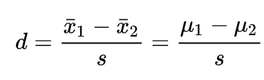
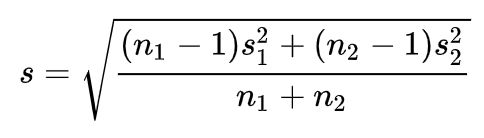
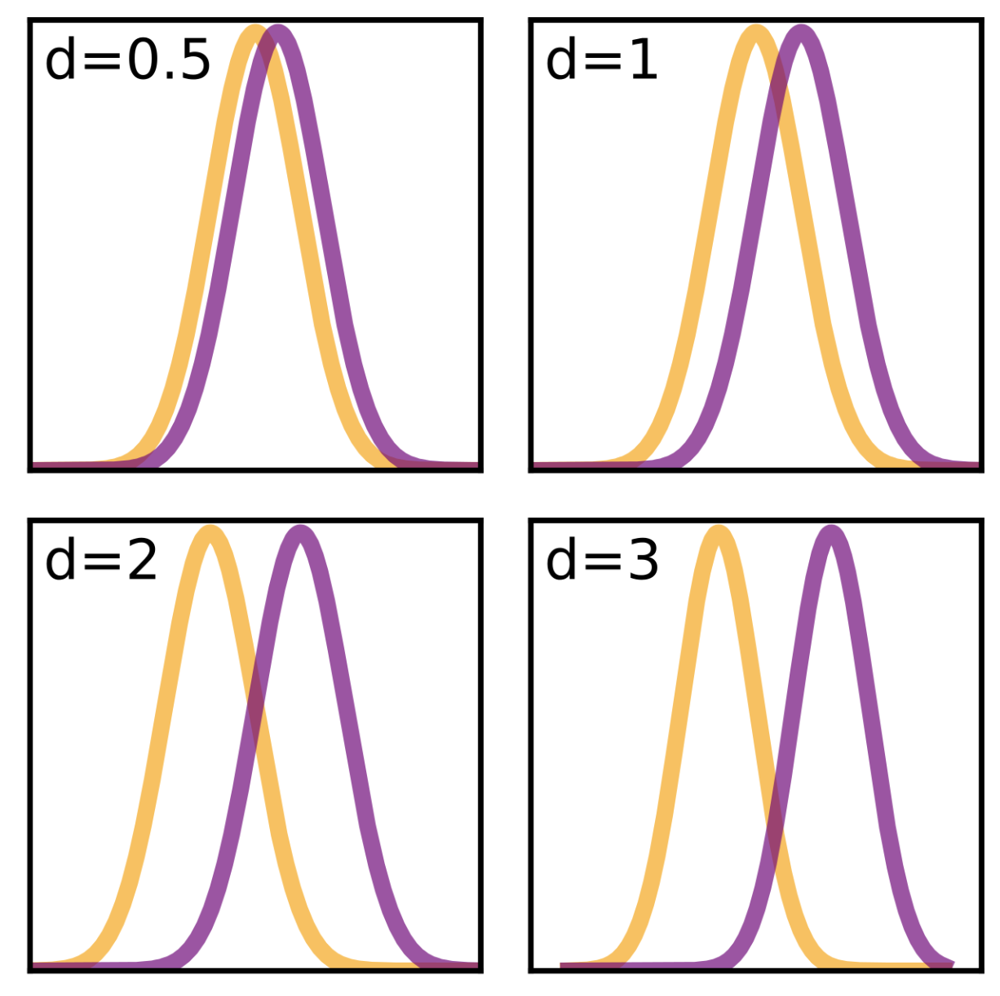

[Think Stats Chapter 2 Exercise 4](http://greenteapress.com/thinkstats2/html/thinkstats2003.html#toc24) (Cohen's d)

The problem is to calculate **Cohen's d** statistic to evaluate the effect size of weight of newborns for first children compared to all the rest (second, third chilren, etc. ), given the NSFG (National Survey of Family Growth) dataset. 

The formula is the following:



Where **s** is a pooled, or composite, standard deviation (the assumptions here is that mean of the population is different, but variance is the same):



I like this visual guide to interpreting **d** from Wikipedia:



I used the flow and assumptions from the book, e.g. taking only successful births into account:
```python
preg = nsfg.ReadFemPreg()
live = preg[preg.outcome == 1]
```
Here are the groups:

```python
firsts = live[live.birthord == 1] 
others = live[live.birthord != 1]
```
The function from the book:

```python
def CohenEffectSize(group1, group2): 
    diff = group1.mean() - group2.mean()
    var1 = group1.var()
    var2 = group2.var()
    n1, n2 = len(group1), len(group2)
    pooled_var = (n1 * var1 + n2 * var2) / (n1 + n2) 
    d = diff / math.sqrt(pooled_var)
    return d 
```
```python
CohenEffectSize(firsts.totalwgt_lb, others.totalwgt_lb)
```
The output is **-0.088672927072602**.

The function rewritten based on Wikipedia formula:

```python
def CohenEffectSize_wiki(group1, group2): 
    difference_mu = group1.mean() - group2.mean()
    sd1 = group1.std()
    sd2 = group2.std()
    n1, n2 = len(group1), len(group2)
    composite_sd = math.sqrt(((n1-1) * sd1**2 + (n2-1) * sd2**2)/ (n1 + n2))
    d = difference_mu / composite_sd
    return d
```
```python
CohenEffectSize_wiki(firsts.totalwgt_lb, others.totalwgt_lb)
```
The output is **-0.08868262821164906**.


