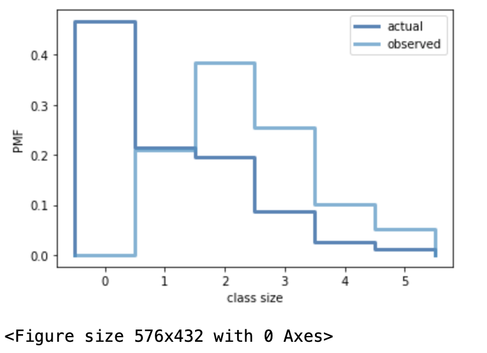

[Think Stats Chapter 3 Exercise 1](http://greenteapress.com/thinkstats2/html/thinkstats2004.html#toc31) (actual vs. biased)

Reading the dataset and constructing two instances of Pmf class - one actual and one biased by the number of children in the family:

```python
resp = nsfg.ReadFemResp()
pmf_actual = thinkstats2.Pmf(resp.numkdhh, label='actual')
pmf_biased = BiasPmf(pmf_actual, label = 'observed')
```
Plotting the result:

```python
thinkplot.PrePlot(2)
thinkplot.Pmfs([pmf_actual, pmf_biased]) 
thinkplot.Show(xlabel='class size', ylabel='PMF')
```

The output:



Means:

```python
pmf_actual.Mean()
print("Actual mean: ", pmf_actual.Mean())
pmf_biased.Mean()
print("Biased mean: ", pmf_biased.Mean())
```
Actual mean:  **1.024205155043831** /n
Biased mean:  **2.403679100664282**

