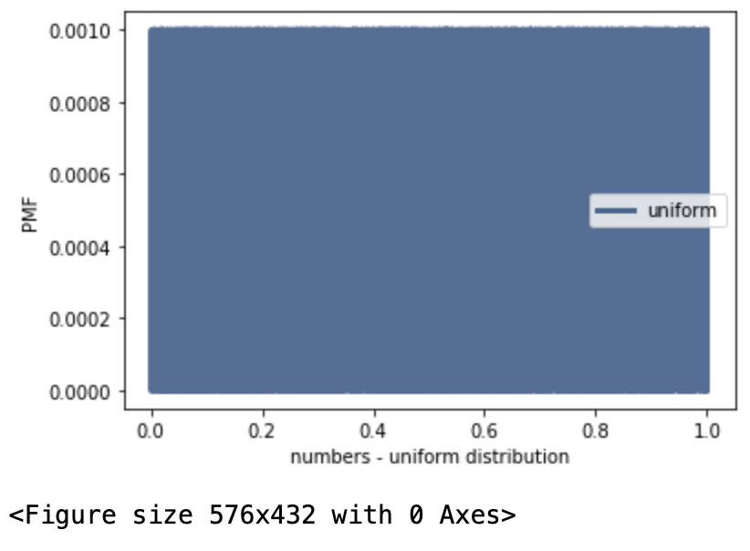
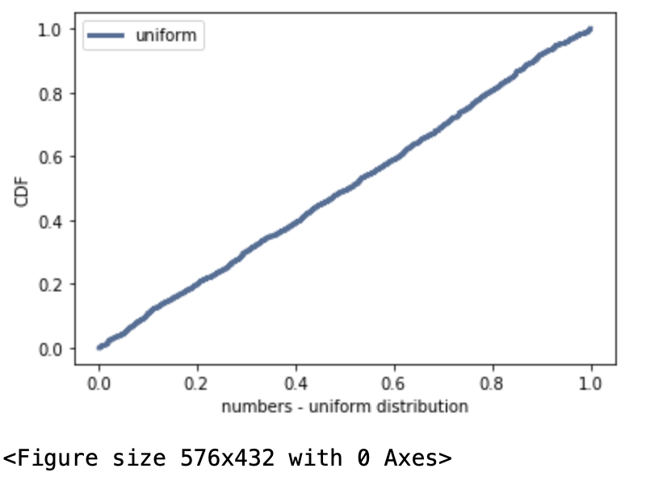

[Think Stats Chapter 4 Exercise 2](http://greenteapress.com/thinkstats2/html/thinkstats2005.html#toc41) (a random distribution)

Getting 1000 random numbers from the uniform distribution:

```python
numbers = np.random.random(1000)
```
Plotting PMF:

```pyhton
pmf = thinkstats2.Pmf(numbers, label='uniform')
thinkplot.Pmf(pmf) 
thinkplot.Show(xlabel='numbers - uniform distribution', ylabel='PMF')
```
The output is of this shape as all numbers are unique, so they have the same probability of 0.001:



Plotting CDF:

```pyhton
cdf = thinkstats2.Cdf(numbers, label='uniform') 
thinkplot.Cdf(cdf) 
thinkplot.Show(xlabel='numbers - uniform distribution', ylabel='CDF')
```
The output is of this shape as the distribution is uniform, so percentile rank is proportional to CDF:


